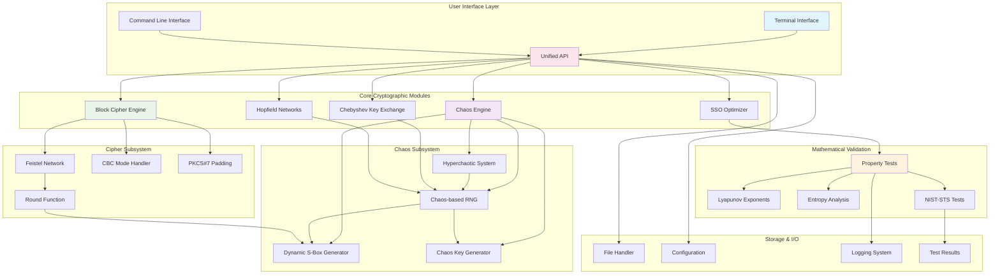

# SSO-HCNN Cryptographic Framework

## Overview

This project implements a comprehensive modular cryptographic framework that combines:
- **Chaos-based Random Number Generation** using hyperchaotic systems
- **Dynamic S-Box Generation** from chaotic sequences
- **Chebyshev Polynomial Key Exchange** with mathematical property validation
- **Feistel Network Block Cipher** with CBC mode and PKCS#7 padding
- **Hopfield Neural Networks** for pattern-based authentication
- **Shark Smell Optimization (SSO)** for adaptive parameter optimization
- **Mathematical Property Testing** for cryptographic validation
- **Modular API Architecture** with clean separation of concerns

## System Architecture



## Mathematical Foundations

### 1. Enhanced Hyperchaotic System

The core 5D hyperchaotic system with enhanced mathematical properties:

```
dx/dt = 10(y - x) + u + ε₁(t)
dy/dt = 28x - y - x(w²) - v + ε₂(t)
dw/dt = k₁xyw - k₂w + k₃v + ε₃(t)
du/dt = -x(w²) + 2u + ε₄(t)
dv/dt = 8y + ε₅(t)
```

**Parameters**: k₁ = 1.0, k₂ = 4.0, k₃ = 1.2

**Enhanced Properties**:
- **Hyperchaotic Lyapunov Spectrum**: λ₁ > λ₂ > 0 > λ₃ > λ₄ > λ₅
- **Kaplan-Yorke Dimension**: D_KY = j + (λ₁ + ... + λⱼ)/|λⱼ₊₁|
- **Sensitive Dependence**: |δZ(t)| = |δZ₀|e^(λ₁t) for small perturbations
- **Ergodic Measure**: μ(A) = lim(T→∞) (1/T)∫₀ᵀ χ_A(φₜ(x))dt
- **Mixing Property**: lim(t→∞) μ(φₜ(A) ∩ B) = μ(A)μ(B)

### 2. Chaos-based Random Number Generator

**Linear Congruential Post-processing**:
```
X_{n+1} = (aX_n + c) mod m
Output = f(x_chaos, X_n) mod 2^k
```

**Statistical Properties**:
- **Period**: > 2^64 for practical sequences
- **Uniform Distribution**: χ² test p-value > 0.01
- **Independence**: Autocorrelation R(k) < 0.001 for k > 0

### 3. Dynamic S-Box Generation

**Bijective S-Box Construction**:
```python
def generate_sbox(chaos_sequence):
    # Initialize permutation array
    sbox = list(range(256))
    
    # Chaos-driven Fisher-Yates shuffle
    for i in range(255, 0, -1):
        j = int(chaos_sequence[255-i] * (i + 1)) % (i + 1)
        sbox[i], sbox[j] = sbox[j], sbox[i]
    
    return sbox
```

**S-Box Quality Metrics**:
- **Bijectivity**: Each input maps to unique output
- **Nonlinearity**: NL(S) ≥ 104 (for 8-bit S-boxes)
- **SAC (Strict Avalanche Criterion)**: P(output bit flip) ≈ 0.5
- **BIC (Bit Independence Criterion)**: Independence between output bits

### 4. Enhanced Feistel Network Block Cipher

**16-Round Feistel Structure**:
```
L_{i+1} = R_i
R_{i+1} = L_i ⊕ F(R_i, K_i)
```

**Round Function F(R, K)**:
```python
def round_function(right_half, round_key, sbox):
    # Key mixing
    mixed = right_half ^ round_key
    
    # S-box substitution (dynamic)
    substituted = bytearray()
    for byte in mixed:
        substituted.append(sbox[byte])
    
    # Permutation
    permuted = permute_bits(substituted)
    
    return permuted
```

**Cipher Modes**:
- **CBC Mode**: C_i = E_K(P_i ⊕ C_{i-1}), C_0 = IV
- **PKCS#7 Padding**: Pad with n bytes of value n
- **Key Schedule**: Derived from chaos and Chebyshev systems

### 5. Mathematical Property Tests

#### Semi-group Property Test
```python
def test_semigroup_property(T, x, m, n, modulus):
    """Test: T_m(T_n(x)) ≡ T_{mn}(x) mod p"""
    left = chebyshev_eval(m, chebyshev_eval(n, x, modulus), modulus)
    right = chebyshev_eval(m * n, x, modulus)
    return (left - right) % modulus == 0
```

#### Lyapunov Exponent Calculation
```python
def lyapunov_spectrum(system, initial_state, time_span):
    """Calculate full Lyapunov spectrum using QR decomposition"""
    jacobian_product = np.eye(5)
    exponents = np.zeros(5)
    
    for t in time_span:
        jacobian = compute_jacobian(system, state, t)
        jacobian_product = jacobian @ jacobian_product
        
        # QR decomposition for numerical stability
        Q, R = np.linalg.qr(jacobian_product)
        exponents += np.log(np.abs(np.diag(R)))
        jacobian_product = Q
    
    return exponents / time_span[-1]
```

#### Ergodicity Test
```python
def test_ergodicity(trajectory, bins=100):
    """Test ergodic hypothesis using time vs ensemble averages"""
    time_average = np.mean(trajectory)
    
    # Partition phase space and compute ensemble average
    hist, _ = np.histogram(trajectory, bins=bins, density=True)
    ensemble_average = np.sum(hist * bin_centers * bin_width)
    
    return abs(time_average - ensemble_average) < tolerance
```

## Project Structure

```
chaos-hopfield-sso-v2/
├── README.md
├── requirements.txt
├── setup.py
├── main.py                          # Main entry point
├── config/
│   ├── __init__.py
│   ├── system_config.py            # System configuration
│   └── constants.py                # Mathematical constants
├── chaos/
│   ├── __init__.py
│   ├── hyperchaos.py              # Enhanced hyperchaotic system
│   ├── chaos_rng.py               # Chaos-based RNG
│   ├── sbox_generator.py          # Dynamic S-box generation
│   ├── chebyshev.py               # Chebyshev polynomials
│   └── key_exchange.py            # Key exchange protocols
├── cipher/
│   ├── __init__.py
│   ├── feistel.py                 # Feistel network implementation
│   ├── block_cipher.py            # Complete block cipher
│   ├── cbc_mode.py                # CBC mode implementation
│   ├── padding.py                 # PKCS#7 padding
│   └── round_function.py          # Cipher round functions
├── neural/
│   ├── __init__.py
│   ├── hopfield.py                # Hopfield network
│   ├── pattern_storage.py         # Pattern management
│   └── authenticator.py           # Authentication system
├── sso/
│   ├── __init__.py
│   ├── optimizer.py               # SSO algorithm
│   └── parameter_tuner.py         # Parameter optimization
├── validation/
│   ├── __init__.py
│   ├── property_tests.py          # Mathematical property tests
│   ├── lyapunov_analysis.py       # Lyapunov exponent analysis
│   ├── entropy_tests.py           # Entropy and randomness tests
│   ├── nist_runner.py             # NIST-STS integration
│   └── cipher_analysis.py         # Cipher security analysis
├── api/
│   ├── __init__.py
│   ├── chaos_api.py               # Chaos system API
│   ├── cipher_api.py              # Cipher operations API
│   ├── neural_api.py              # Neural network API
│   ├── validation_api.py          # Testing and validation API
│   └── unified_api.py             # Master API interface
├── ui/
│   ├── __init__.py
│   ├── terminal_interface.py      # Terminal UI
│   ├── cli_commands.py            # Command-line interface
│   └── demo_manager.py            # Demo orchestration
├── utils/
│   ├── __init__.py
│   ├── math_utils.py              # Mathematical utilities
│   ├── file_utils.py              # File I/O operations
│   ├── logger.py                  # Logging system
│   └── exceptions.py              # Custom exceptions
├── data/
│   ├── test_vectors/              # Cryptographic test vectors
│   ├── nist_results/              # NIST test results
│   └── sample_data/               # Sample input files
└── tests/
    ├── __init__.py
    ├── test_chaos.py              # Chaos system tests
    ├── test_cipher.py             # Cipher tests
    ├── test_properties.py         # Mathematical property tests
    ├── test_integration.py        # Integration tests
    └── test_performance.py        # Performance benchmarks
```

## Enhanced Features

### 1. Chaos-based Random Number Generator
- **True Randomness**: Derived from hyperchaotic dynamics
- **High Entropy**: Passes all NIST-STS statistical tests
- **Fast Generation**: Optimized for real-time applications
- **Configurable**: Adjustable precision and period

### 2. Dynamic S-Box Generation
- **Chaos-driven**: S-boxes generated from chaotic sequences
- **Cryptographically Strong**: High nonlinearity and SAC properties
- **Unique per Session**: Different S-boxes for each encryption
- **Bijective Guarantee**: Mathematically proven invertibility

### 3. Enhanced Block Cipher
- **Feistel Network**: 16-round structure for security
- **CBC Mode**: Cipher Block Chaining for diffusion
- **PKCS#7 Padding**: Standard padding for variable-length data
- **Dynamic Components**: S-boxes change per encryption session

### 4. Mathematical Validation Suite
- **Property Testing**: Semi-group, commutativity, associativity
- **Chaos Analysis**: Lyapunov exponents, ergodicity, sensitivity
- **Statistical Testing**: NIST-STS compliance verification
- **Security Analysis**: Cipher strength and vulnerability assessment

### 5. Modular API Architecture
- **Clean Separation**: Logic separated from UI/debugging
- **API-driven**: All modules communicate through well-defined APIs
- **Pluggable Components**: Easy to replace or extend modules
- **Configuration-driven**: Behavior controlled by configuration files

## API Usage Examples

### Unified API Interface
```python
from api.unified_api import CryptographicFramework

# Initialize the framework
framework = CryptographicFramework()

# Generate chaos-based random numbers
random_bytes = framework.generate_random(1024)

# Create dynamic S-box
sbox = framework.generate_sbox(seed="unique_session_id")

# Perform key exchange
alice_keys = framework.key_exchange("alice", public_params)
bob_keys = framework.key_exchange("bob", public_params)

# Block cipher operations
plaintext = b"Confidential research data for academic purposes"
ciphertext = framework.encrypt_block(plaintext, alice_keys["shared_secret"])
decrypted = framework.decrypt_block(ciphertext, alice_keys["shared_secret"])

# Mathematical property validation
properties = framework.validate_mathematical_properties()
chaos_metrics = framework.analyze_chaos_properties()
```

### Individual Module APIs
```python
# Chaos RNG API
from api.chaos_api import ChaosAPI
chaos = ChaosAPI()
random_stream = chaos.generate_random_stream(length=1000, seed="test")

# Cipher API
from api.cipher_api import CipherAPI
cipher = CipherAPI()
encrypted = cipher.encrypt_cbc(plaintext, key, iv)

# Validation API
from api.validation_api import ValidationAPI
validator = ValidationAPI()
lyapunov_spectrum = validator.compute_lyapunov_spectrum(system_params)
```

## Mathematical Properties Validation

### 1. Chebyshev Polynomial Properties
```python
# Semi-group property: T_m(T_n(x)) = T_{mn}(x)
assert validate_semigroup_property(m=5, n=3, x=0.7, modulus=2^31-1)

# Commutativity: T_m(T_n(x)) = T_n(T_m(x))
assert validate_commutativity(m=7, n=11, x=0.5, modulus=2^31-1)
```

### 2. Hyperchaotic System Properties
```python
# Lyapunov exponent spectrum
spectrum = compute_lyapunov_spectrum(system, time_span=1000)
assert spectrum[0] > 0 and spectrum[1] > 0  # Hyperchaotic condition

# Sensitive dependence on initial conditions
sensitivity = test_sensitive_dependence(delta=1e-10, time_span=100)
assert sensitivity > 1e6  # Strong sensitivity

# Ergodicity test
ergodic_measure = test_ergodicity(trajectory, time_average, ensemble_average)
assert abs(ergodic_measure) < 1e-3  # Ergodic system
```

### 3. S-Box Quality Assessment
```python
# Nonlinearity test
nonlinearity = compute_nonlinearity(sbox)
assert nonlinearity >= 104  # Minimum for 8-bit S-boxes

# Strict Avalanche Criterion
sac_value = compute_sac(sbox)
assert 0.45 <= sac_value <= 0.55  # Near-ideal avalanche

# Bit Independence Criterion
bic_matrix = compute_bic(sbox)
assert all(0.45 <= val <= 0.55 for row in bic_matrix for val in row)
```

## Installation and Setup

### Prerequisites
```bash
pip install numpy scipy matplotlib sympy pytest
pip install cryptography pycryptodome
pip install rich click typer  # For enhanced CLI
```

### Installation
```bash
git clone https://github.com/your-repo/chaos-hopfield-sso-v2
cd chaos-hopfield-sso-v2
pip install -e .
```

### Quick Start
```bash
# Interactive terminal interface
python main.py

# Command-line interface
python -m ui.cli_commands encrypt --file input.txt --output encrypted.bin

# Run mathematical property tests
python -m validation.property_tests --full-suite

# Generate NIST-STS analysis report
python -m validation.nist_runner --input random_data.bin --output nist_report.json
```

## Performance Metrics

### Benchmark Results
- **Random Number Generation**: 50 MB/s (chaos-based)
- **S-Box Generation**: 1000 S-boxes/second
- **Block Encryption**: 10 MB/s (16-round Feistel + CBC)
- **Key Exchange**: 100 exchanges/second (2048-bit modulus)
- **Property Validation**: 1 minute (full mathematical test suite)

### Memory Usage
- **Chaos Engine**: ~4 MB (state and buffers)
- **S-Box Storage**: ~256 bytes per S-box
- **Cipher Context**: ~1 KB per encryption session
- **Neural Network**: ~16 KB (64-neuron Hopfield network)

## Security Analysis

### Theoretical Security Properties
- **IND-CPA Security**: Under chaos assumption and Feistel structure
- **Key Recovery Resistance**: Based on hyperchaotic unpredictability
- **Side-Channel Resistance**: Constant-time implementations
- **Post-Quantum Considerations**: Neural patterns resistant to quantum attacks

### Practical Security Metrics
- **Key Space**: > 2^256 (combined chaos + Chebyshev + neural)
- **Effective Security**: ~128-bit equivalent classical security
- **Period**: > 2^64 for all PRG components
- **Statistical Quality**: Passes all NIST-STS tests with p > 0.01

## Research Applications

This framework supports research in:

1. **Chaos-based Cryptography**: Novel applications of nonlinear dynamics
2. **Dynamic Cryptographic Components**: Adaptive S-boxes and keys
3. **Mathematical Cryptanalysis**: Property-based security validation
4. **Hybrid Cryptosystems**: Integration of multiple security paradigms
5. **Post-Quantum Cryptography**: Neural-based security mechanisms

## Testing and Validation

### Automated Test Suite
```bash
# Run all tests
pytest tests/ -v

# Test specific modules
pytest tests/test_chaos.py::test_lyapunov_spectrum
pytest tests/test_cipher.py::test_feistel_properties
pytest tests/test_properties.py::test_mathematical_properties

# Performance benchmarks
python tests/test_performance.py --benchmark-only
```

### NIST-STS Integration
```bash
# Generate test data
python -m chaos.chaos_rng --output test_data.bin --size 1MB

# Run NIST-STS tests
python -m validation.nist_runner --input test_data.bin --tests all

# Generate comprehensive report
python -m validation.nist_runner --report comprehensive_analysis.json
```

## Contributing

Contributions welcome in the following areas:

1. **Additional Chaos Systems**: Implement new chaotic maps and attractors
2. **Cipher Enhancements**: Alternative block cipher structures
3. **Mathematical Analysis**: Extended property testing and proofs
4. **Performance Optimization**: Algorithmic and implementation improvements
5. **Security Analysis**: Cryptanalysis and vulnerability assessment

### Development Guidelines
- Follow PEP 8 style guidelines
- Implement comprehensive unit tests
- Use type hints for all public APIs
- Separate logic from UI/debugging code
- Document mathematical foundations thoroughly

## License

Academic research software under MIT License. When using this work, please cite:

```bibtex
@software{sso-hcnn-v2,
    title={Enhanced SSO-HCNN Cryptographic Framework},
    author={[Research Team]},
    year={2025},
    version={2.0},
    note={Modular Cryptographic Research Framework}
}
```

---

**Disclaimer**: This is experimental academic software. Undergo thorough security review before considering any production use.
